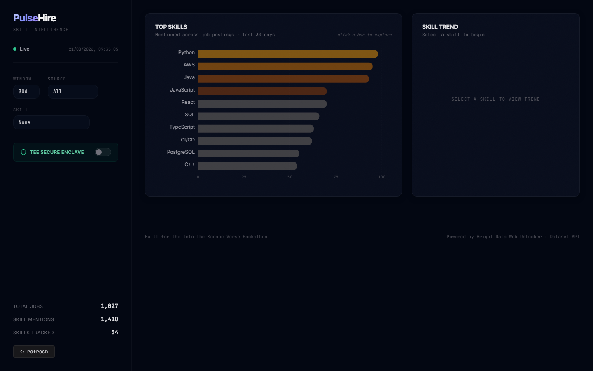
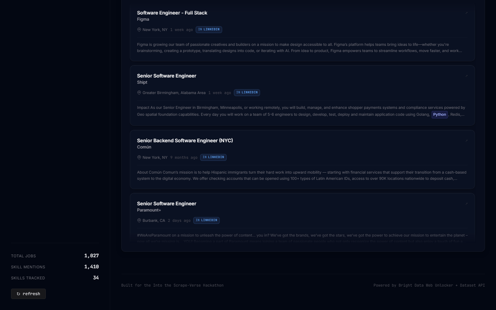
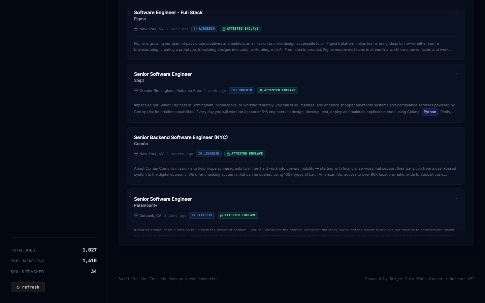
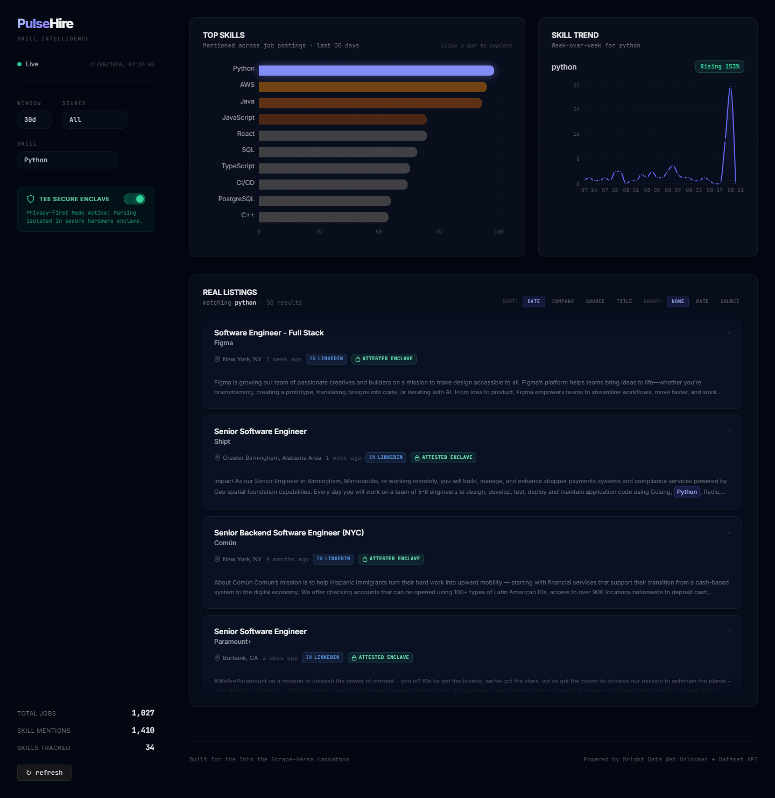

# 🚀 PulseHire

> **Real-time pulse of the tech job market.**
> *Stop guessing. Start tracking.*

[]()
[]()
[]()
[]()
[]()
[]()
[]()
[]()

PulseHire is a dashboard that tracks how often specific tech skills (like *"Agentic AI"*, *"Rust"*, *"React"*) appear in job listings across major job boards. It visualizes which skills are **rising 📈**, **stable ➡️**, and **falling 📉** over time — so students and career switchers can make data-driven decisions about what to learn next.

---

## 📑 Table of Contents

- [✨ Features](#-features)
- [🖼️ Screenshots](#-screenshots)
- [🏗️ Architecture](#-architecture)
- [🛠️ Tech Stack](#-tech-stack)
- [📂 Project Structure](#-project-structure)
- [🚀 Getting Started](#-getting-started)
- [📜 Available Scripts](#-available-scripts)
- [🔌 API Endpoints](#-api-endpoints)
- [🗄️ Database Schema](#-database-schema)
- [🤝 Contributing](#-contributing)
- [📄 License](#-license)
- [👥 Authors](#-authors)
- [🙏 Acknowledgments](#-acknowledgments)

---

## ✨ Features

- 📊 **Top Skills Bar Chart** — see the 10 most-mentioned skills in real time
- 📈 **Trend Line Charts** — track any skill's demand over the last 30 days
- 🔍 **Smart Filters** — drill down by skill, location, or job board
- 🔄 **One-Click Refresh** — manually trigger a fresh scrape
- 🌐 **Multi-Source Aggregation** — combine data from multiple job boards
- 💾 **Persistent Storage** — SQLite keeps your historical data safe
- ⚡ **Fast Charts** — pre-aggregated counts make dashboards load instantly
- 🎨 **Beautiful UI** — Tailwind CSS, responsive, beginner-friendly

---

## 🖼️ Screenshots

> _(Add screenshots of your dashboard here once built — `docs/screenshots/` folder)_

| Dashboard Overview | Top Skills Chart |
|---|---|
|  |  |

| Skill Trend | Job Listings |
|---|---|
|  |  |

| TEE Secure Enclave | Full Page |
|---|---|
|  |  |

---

## 🏗️ Architecture

PulseHire uses a **decoupled 3-tier architecture**:

```
┌─────────────────────────────────────────────────────────────┐
│                  FRONTEND  (React + Tailwind)                │
│   Bar Charts  •  Trend Lines  •  Filters  •  Refresh Btn   │
└──────────────────────────┬──────────────────────────────────┘
                           │  REST API
                           ▼
┌─────────────────────────────────────────────────────────────┐
│                  BACKEND  (FastAPI - Python)                │
│   /api/skills/top  •  /api/skills/trend  •  /api/refresh   │
└──────────────────────────┬──────────────────────────────────┘
                           │
                           ▼
┌─────────────────────────────────────────────────────────────┐
│   SCRAPER (Python)  ──►  SQLite Database  ──►  Dashboard   │
└─────────────────────────────────────────────────────────────┘
```

📄 **Full details:** See [`ARCHITECTURE.md`](./ARCHITECTURE.md)
📋 **Product specs:** See [`PRD.md`](./PRD.md)
🗄️ **DB schema:** See [`DATABASE.md`](./DATABASE.md)

---

## 🛠️ Tech Stack

### Backend
- **Python 3.10+** — main language
- **FastAPI** — modern, fast web framework
- **SQLite** — lightweight database
- **SQLAlchemy** *(optional)* — ORM
- **BeautifulSoup4 + requests** — web scraping
- **APScheduler** — scheduled scraping jobs
- **Pandas** — data wrangling

### Frontend
- **React 18** — UI library
- **Vite** — blazing-fast dev server
- **Tailwind CSS** — utility-first styling
- **Recharts** — beautiful, composable charts
- **Axios** — HTTP client

### Tooling
- **Git** — version control
- **VS Code** — recommended editor
- **Postman / curl** — API testing

---

## 📂 Project Structure

```
pulsehire/
├── README.md                ← you are here
├── PRD.md                   ← product requirements
├── ARCHITECTURE.md          ← system design
├── DATABASE.md              ← DB schema docs
│
├── backend/
│   ├── main.py              # FastAPI app entry
│   ├── database.py          # SQLite connection
│   ├── models.py            # Pydantic models
│   ├── init_db.py           # DB setup script
│   ├── requirements.txt
│   ├── .env.example
│   ├── services/
│   │   ├── skills_service.py
│   │   └── jobs_service.py
│   ├── scraper/
│   │   ├── __init__.py
│   │   ├── indeed.py        # Indeed scraper
│   │   ├── naukri.py        # (stretch) Naukri scraper
│   │   ├── skills.py        # Skill extractor
│   │   └── scheduler.py     # APScheduler
│   └── data/
│       └── pulsehire.db     # SQLite file (auto-created)
│
├── frontend/
│   ├── package.json
│   ├── vite.config.js
│   ├── tailwind.config.js
│   ├── postcss.config.js
│   ├── index.html
│   └── src/
│       ├── main.jsx
│       ├── App.jsx
│       ├── index.css
│       ├── api.js           # Axios client
│       └── components/
│           ├── Dashboard.jsx
│           ├── TopSkillsChart.jsx
│           ├── SkillTrendChart.jsx
│           ├── FilterPanel.jsx
│           ├── RefreshButton.jsx
│           └── JobList.jsx
│
└── docs/
    ├── screenshots/
    └── DEMO_SCRIPT.md
```

---

## 🚀 Getting Started

### Prerequisites

Make sure you have these installed:

- **Python 3.10+** → [python.org](https://python.org)
- **Node.js 18+** → [nodejs.org](https://nodejs.org)
- **Git** → [git-scm.com](https://git-scm.com)

Check your versions:
```bash
python --version    # Python 3.10+
node --version      # v18+
npm --version       # v9+
```

---

### 🔧 Backend Setup

```bash
# 1. Navigate to backend
cd backend

# 2. Create a virtual environment
python -m venv venv

# 3. Activate it
# On Windows:
venv\Scripts\activate
# On macOS/Linux:
source venv/bin/activate

# 4. Install dependencies
pip install -r requirements.txt

# 5. Initialize the database
python init_db.py

# 6. Start the server
uvicorn main:app --reload --port 8000
```

✅ Backend running at **http://localhost:8000**
📚 Auto-generated API docs at **http://localhost:8000/docs**

---

### 🎨 Frontend Setup

```bash
# 1. Open a new terminal, navigate to frontend
cd frontend

# 2. Install dependencies
npm install

# 3. Start the dev server
npm run dev
```

✅ Frontend running at **http://localhost:5173**

---

### 🌱 (Optional) Seed Sample Data

If you want to see the dashboard working **without** waiting for a real scrape:

```bash
cd backend
python scraper/seed_sample_data.py
```

This inserts ~500 fake jobs across 30 skills with 30 days of history. Perfect for demos.

---

## 📜 Available Scripts

### Backend
| Command | What it does |
|---|---|
| `uvicorn main:app --reload` | Start dev server with hot reload |
| `python init_db.py` | Create tables + seed 30 skills |
| `python scraper/seed_sample_data.py` | Insert demo data |
| `python scraper/run_scrape.py` | Manually trigger a scrape |

### Frontend
| Command | What it does |
|---|---|
| `npm run dev` | Start dev server |
| `npm run build` | Build for production |
| `npm run preview` | Preview production build |
| `npm run lint` | Run ESLint |

---

## 🔌 API Endpoints

Base URL: `http://localhost:8000`

| Method | Endpoint | Description |
|---|---|---|
| `GET` | `/api/skills/top?limit=10` | Top N skills by mention count |
| `GET` | `/api/skills/trend?skill=rust&days=30` | Daily counts for a skill |
| `GET` | `/api/skills/list` | All 30 tracked skills |
| `GET` | `/api/jobs?skill=python&limit=20` | Sample jobs for a skill |
| `GET` | `/api/locations` | Available locations |
| `POST` | `/api/refresh` | Trigger a fresh scrape |
| `GET` | `/api/stats` | DB stats + last refresh time |
| `GET` | `/docs` | **Interactive API docs (Swagger UI)** |

### Example Calls

```bash
# Get top 10 skills
curl http://localhost:8000/api/skills/top?limit=10

# Get Rust trend for last 30 days
curl "http://localhost:8000/api/skills/trend?skill=rust&days=30"

# Trigger a fresh scrape
curl -X POST http://localhost:8000/api/refresh
```

---

## 🗄️ Database Schema

5 tables — see [`DATABASE.md`](./DATABASE.md) for full details.

| Table | Purpose |
|---|---|
| `jobs` | Raw scraped job postings |
| `skills` | Master list of 30 tracked skills |
| `skill_mentions` | Many-to-many: which job mentions which skill |
| `daily_skill_counts` | Pre-aggregated daily counts (fast charts) |
| `scrape_runs` | Logging for every scrape attempt |

---

## 🤝 Contributing

This is a hackathon project, but contributions are welcome!

1. Fork the repo
2. Create your feature branch (`git checkout -b feature/AmazingFeature`)
3. Commit your changes (`git commit -m 'Add some AmazingFeature'`)
4. Push to the branch (`git push origin feature/AmazingFeature`)
5. Open a Pull Request

### Code Style
- **Python:** PEP 8, type hints encouraged
- **JavaScript:** ESLint config (Airbnb style)
- **Commits:** Conventional Commits (`feat:`, `fix:`, `docs:`)

---

## 📄 License

Distributed under the **MIT License**. See `LICENSE` for more info.

```
MIT License

Copyright (c) 2026 PulseHire Contributors

Permission is hereby granted, free of charge, to any person obtaining a copy
of this software and associated documentation files (the "Software"), to deal
in the Software without restriction...
```

---

## 👥 Authors

- **Your Name** — *Initial work* — [@yourhandle](https://github.com/yourhandle)

Built during **\[Hackathon Name\] · 2026**

---

## 🙏 Acknowledgments

- Inspired by the pain of every student asking *"What should I learn next?"*
- Thanks to **Indeed** and **Naukri** for public job listings
- Built with ❤️ and a lot of `time.sleep(2)` to be polite to servers
- Special thanks to the **FastAPI**, **React**, and **Tailwind CSS** communities

---

## 📚 Additional Documentation

- 📋 [Product Requirements (PRD)](./PRD.md)
- 🏗️ [System Architecture](./ARCHITECTURE.md)
- 🗄️ [Database Schema](./DATABASE.md)
- 🎤 [Demo Script](./docs/DEMO_SCRIPT.md)

---

<p align="center">
  Made with ❤️ for the hackathon
  <br>
  <strong>PulseHire</strong> — <em>Stop guessing. Start tracking.</em>
</p>
